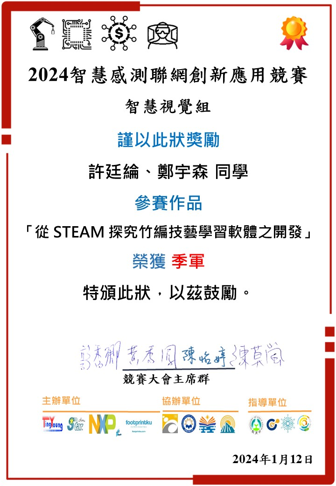

# 竹編技藝學習軟體 — Bamboo Weaving Learning Platform

> 垂直整合專題：從 STEAM 探究竹編技藝學習軟體之開發
> 榮獲 2024 智慧感測聯網創新應用競賽「智慧視覺組」季軍



---

## 開發動機

為讓竹編文化跨世代傳承，本專案結合 STEAM 教育理念與深度學習技術，開發一套遊戲化學習平台。孩子們能透過遊戲方式體驗並學習竹編技藝，認識其文化價值。並與教育系合作，提供教師自訂出題、批改與即時回饋的功能。

---

## 系統架構

```
客戶端（遊戲 App）
       │  POST URL
       ▼
  get_img.php          ← 主要 API 入口
       │
       ├─ download.php          ← cURL 下載圖片
       ├─ analyze_img_1_1.py    ← OpenCV 影像分析
       └─ return_json.php       ← 查詢分析結果
```

---

## 功能說明

### 1. 影像取得
客戶端透過 POST 請求，將圖片 URL 傳送至伺服器。伺服器使用 cURL 自動下載目標圖片。

### 2. 影像分析（色域差分析）
- 將圖片縮放至 360×360，轉換至 HSV 色彩空間
- 將影像切割為 5×5 共 25 個區塊
- 針對每個區塊判斷主色（綠／藍／紅／未知）
- 以棋盤格模式比對各區塊顏色，偵測排列錯誤的區域
- 計算正確率（`percent`）並標記錯誤區域（`wrong_area`）

### 3. 結果儲存與查詢
- 分析結果（含標記後圖片 Base64、正確率、錯誤數、錯誤座標）存入 MySQL
- 客戶端可透過 `game_id` 查詢並取回結果，查詢後自動刪除紀錄

---

## 技術棧

| 層級 | 技術 |
|------|------|
| 影像分析 | Python 3、OpenCV (`cv2`)、NumPy |
| 後端 API | PHP 8、PDO |
| 資料庫 | MySQL（`bamboo_weaving` DB） |
| 伺服器環境 | XAMPP（Apache + MySQL） |
| 圖片下載 | PHP cURL |

---

## 環境需求

- XAMPP（或同等 Apache + MySQL 環境）
- PHP 8+（需啟用 `curl`、`pdo_mysql` 擴充）
- Python 3.x
- Python 套件：`opencv-python`、`numpy`

```bash
pip install opencv-python numpy
```

---

## 安裝與設定

1. 將專案複製至 XAMPP 的網頁根目錄：
   ```
   C:/xampp/htdocs/bamboo_weaving/
   ```

2. 建立 MySQL 資料庫與資料表：
   ```sql
   CREATE DATABASE bamboo_weaving CHARACTER SET utf8mb4;

   USE bamboo_weaving;

   CREATE TABLE return_json (
       id       INT AUTO_INCREMENT PRIMARY KEY,
       game_id  VARCHAR(64) NOT NULL,
       json     TEXT NOT NULL
   );
   ```

3. 若資料庫帳密不同，請修改 `login.php`：
   ```php
   $user = 'root';
   $pass = '';  // 修改為實際密碼
   ```

4. 確認 Python 可在命令列執行：
   ```bash
   python --version
   ```

---

## API 文件

### POST `/get_img.php` — 提交圖片進行分析

**Request（application/x-www-form-urlencoded）**

| 欄位 | 型別 | 說明 |
|------|------|------|
| `email` | string | 使用者 Email |
| `game_id` | string | 遊戲場次 ID |
| `topic_id` | string | 題目編號（對應分析腳本版本） |
| `level_id` | string | 關卡編號 |
| `url` | string | 竹編圖片的公開圖片 URL |

**Response**

```json
{ "result": true }
```

---

### POST `/return_json.php` — 查詢分析結果

**Request（application/x-www-form-urlencoded）**

| 欄位 | 型別 | 說明 |
|------|------|------|
| `game_id` | string | 遊戲場次 ID |

**Response（成功）**

```json
{
  "result": true,
  "data": {
    "game_id": "42",
    "topic_id": 1,
    "level_id": 1,
    "photo": "<base64-encoded-image>",
    "percent": 0.88,
    "number": 3,
    "wrong_area": [[0, 2], [3, 1]]
  }
}
```

| 欄位 | 說明 |
|------|------|
| `percent` | 竹編排列正確率（0.0 ~ 1.0） |
| `number` | 錯誤區塊數量 |
| `wrong_area` | 錯誤區塊的 `[row, col]` 座標列表（5×5 格） |
| `photo` | 標記錯誤位置後的圖片（Base64） |

---

## 專案結構

```
bamboo_weaving/
├── analyze_img_1_1.py   # 影像色域分析主程式（OpenCV）
├── get_img.php          # 主要 API：下載圖片 → 分析 → 存 DB
├── return_json.php      # 查詢 API：依 game_id 取回分析結果
├── download.php         # cURL 圖片下載輔助函式
├── login.php            # 資料庫連線設定
└── README.md
```

---

## 色彩判斷邏輯

`analyze_img_1_1.py` 以 HSV 色相（Hue）判斷每個區塊的主色：

| 色相範圍 | 顏色 | 代碼 |
|----------|------|------|
| 72 ~ 91 | 綠色 | 1 |
| 98 ~ 112 | 藍色 | 2 |
| 125 ~ 179 | 紅色 | 3 |
| 其他 | 未知 | 0 |

正確的竹編圖案應呈棋盤交錯排列，系統透過窮舉所有色彩組合找出錯誤最少的對應方式。

---

## 授權

本專案為學術競賽作品，僅供學術與教育用途參考。
